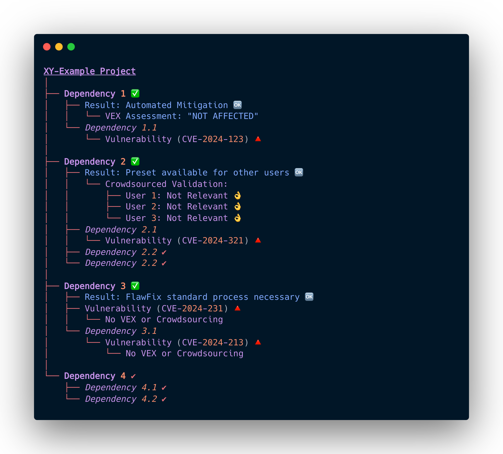
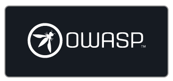
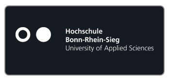

DAS IST MEINE ERSTE ÄNDERUNG


<!--
<!-- Improved compatibility of back to top link: See: https://github.com/othneildrew/Best-README-Template/pull/73 -->
<a name="readme-top"></a>
<!--
*** Thanks for checking out the Best-README-Template. If you have a suggestion
*** that would make this better, please fork the repo and create a pull request
*** or simply open an issue with the tag "enhancement".
*** Don't forget to give the project a star!
*** Thanks again! Now go create something AMAZING! :D
-->

<!-- PROJECT LOGO -->
<br />
<div align="center">

  <picture>
    <source srcset="images/logo_inverse_horizontal.svg"  media="(prefers-color-scheme: dark)">
    
  </picture>

  <h3 align="center">DevGuard - Develop Secure Software - Backend</h3>

  <p align="center">
    Manage your CVEs seamlessly, Integrate your Vulnerability Scanners, Documentation made easy, Compliance to security Frameworks
    <br />
    <br />
    <a href="https://github.com/l3montree-dev/devguard/issues">Report Bug</a>
    ·
    <a href="https://github.com/l3montree-dev/devguard/issues">Request Feature</a>
    ·
    <a href="https://github.com/l3montree-dev/devguard?tab=readme-ov-file#sponsors-and-supporters-">Sponsors</a>
  </p>
</div>

<p align="center">
   <a href="https://www.bestpractices.dev/projects/8928"></a>
   <a href="https://github.com/l3montree-dev/devguard/blob/main/LICENSE.txt"></a>
   <a href="https://github.com/l3montree-dev/devguard/issues?q=is%3Aopen+is%3Aissue+label%3A%22help+wanted%22"></a>
</p>

<p align="center">
Get in touch with the developers directly via 
  <a href="https://matrix.to/#/#devguard:matrix.org">Matrix-Chat</a>
</p>

<!-- TABLE OF CONTENTS -->
<details>
  <summary>Table of Contents</summary>
  <ol>
    <li>
      <a href="#mission">Mission</a>
    </li>
    <li>
      <a href="#the-problem-we-solve">The Problem We Solve</a>
    </li>
    <li><a href="#key-features">Key Features</a></li>
    <li><a href="#understanding-the-owasp-devsecops-pipeline">DevGuard supports developers in the implementation of the DevSecOps-Pipeline</a>
      <ul>
        <li><a href="#secret-scanning">Secret Scanning (Coming Soon)</a></li>
         <li><a href="#software-composition-analysis-sca">Software Composition Analysis (SCA)</a></li>
        <li><a href="#static-application-security-testing-sast">Static Application Security Testing (SAST) (Coming Soon)</a></li>
        <li><a href="#infrastructure-as-code-iac-scanning">Infrastructure as Code (IaC) Scanning (Coming Soon)</a></li>
        <li><a href="#container-scanning">Container Scanning (Coming Soon)</a></li>
        <li><a href="#dynamic-application-security-testing-dast">Dynamic Application Security Testing (DAST) (Coming Soon)</a></li>
      </ul>
    </li>
    <li><a href="#joint-vulnerability-management---the-strength-of-exchange">Joint vulnerability management - the strength of exchange</a></li>
    <li><a href="#local-quickstart">Local Quickstart</a></li>
    <li><a href="#contributing">Contributing</a></li>
    <li><a href="#code-of-conduct">Code of Conduct</a></li>
    <li><a href="#built-with">Built With</a></li>
    <li><a href="#license">License</a></li>
  </ol>
</details>

<!-- ABOUT THE PROJECT -->
## Mission

DevGuard is built by developers, for developers, aiming to simplify the complex world of vulnerability management. Our goal is to integrate security seamlessly into the software development lifecycle, ensuring that security practices are accessible and efficient for everyone, regardless of their security expertise.

### Demo

We are using DevGuard to scan and manage the risks of DevGuard itself—essentially eating our own dogfood. The project can be found here:

[DEMO](https://main.devguard.org/l3montree-cybersecurity/projects/devguard)

We believe VEX information should be shared via a link due to its dynamic nature, as what is risk-free today may be affected by a CVE tomorrow. We've integrated the DevGuard risk scoring into the metrics, with detailed documentation on its calculation to follow soon. SBOM and VEX data are always up to date at these links: 

|Project|SBOM|VeX|
|---|---|---|
|[Devguard Golang API](https://github.com/l3montree-dev/devguard)|[SBOM](https://main.devguard.org/l3montree-cybersecurity/projects/devguard/assets/devguard/refs/main/sbom.json?scanner=github.com%2Fl3montree-dev%2Fdevguard%2Fcmd%2Fdevguard-scanner%2Fcontainer-scanning)|[VeX](https://main.devguard.org/l3montree-cybersecurity/projects/devguard/assets/devguard/refs/main/vex.json?scanner=github.com%2Fl3montree-dev%2Fdevguard%2Fcmd%2Fdevguard-scanner%2Fcontainer-scanning)|
|[Devguard Web-Frontend](https://github.com/l3montree-dev/devguard-web)|[SBOM](https://main.devguard.org/l3montree-cybersecurity/projects/devguard/assets/devguard-web/refs/main/sbom.json?scanner=github.com%2Fl3montree-dev%2Fdevguard%2Fcmd%2Fdevguard-scanner%2Fcontainer-scanning)|[VeX](https://main.devguard.org/l3montree-cybersecurity/projects/devguard/assets/devguard-web/refs/main/vex.json?scanner=github.com%2Fl3montree-dev%2Fdevguard%2Fcmd%2Fdevguard-scanner%2Fcontainer-scanning)|

### The problem we solve

Identifying and managing software vulnerabilities is an increasingly critical challenge. Developers often face security issues without the proper training or tools that fit into their everyday workflows. DevGuard is a developer-centered software designed to provide simple, modern solutions for vulnerability detection and management, compliant with common security frameworks.

In 2023 alone, cyberattacks caused approximately 206 billion euros in damage only in Germany. Many of these attacks exploited software vulnerabilities. With agile and DevOps methodologies becoming standard, the need for integrating security into the development process has never been greater. We aim to fill this gap with DevGuard, offering a seamless integration of vulnerability management into development workflows.

#### Prioritizing Vulnerabilities

Not all vulnerabilities pose the same level of risk to your project. Effective prioritization of vulnerabilities is crucial to ensure that resources are focused on addressing the most critical issues. DevGuard helps you focus on what truly matters by providing risk assessments based on CVSS scores, exploit availability (ExploitDB), and real-world threat data (EPSS). This approach converts a generic `--exit-code 1 --severity CRITICAL` (like trivy has it) to a more practical `--exit-code 1 --risk CRITICAL` strategy, ensuring that you address vulnerabilities that could have the most significant impact on your software.

To further illustrate the importance of prioritizing vulnerabilities, consider our Sankey diagram, which demonstrates how many high CVSS vulnerabilities are reassessed and reprioritized. The diagram shows that a significant portion of these vulnerabilities are mapped to EPSS scores in the 0-10% range, indicating a lower likelihood of exploitation. This visual representation underscores the necessity of a nuanced approach to vulnerability management, where not all "critical" CVEs are treated equally, but rather prioritized based on their actual risk.


<p>
    <em>Sankey diagram showing the CVSS Base-Score and the adjusted score after applying threat intelligence and the application security requirements to the cvss calculation. The scores then get mapped to their corresponding EPSS (Exploit prediction scoring system).</em>
</p>
<p align="right">(<a href="#readme-top">back to top</a>)</p>

## Key Features

1. **Developer-Centric Integration:** DevGuard fits naturally into your existing CI/CD workflows, reducing friction and enhancing productivity. It supports the OWASP DevSecOps pipeline, offering tools (we just reuse open source tools but provide a simplified wrapper cli) for secret scanning (coming soon), SAST (coming soon), SCA, IaC scanning (coming soon), container scanning (coming soon), and DAST (coming soon).
2. **Automated Security Monitoring:** Continuous monitoring using Software Bill of Materials (SBOMs) to keep your projects secure.
3. **Risk Assessment:** Automatically assesses and prioritizes risks to help you address the most critical vulnerabilities first — no really, we do this pragmatically and automate where possible! (Our base: CVSS, exploitdb, EPSS)
4. **Compliance:** Ensures your projects meet security standards like ISO/IEC 27001 and PCI-DSS.
5. **Security and confidentiality:** We prioritize the security of this software! In an expansion stage and in cooperation with research institutions, we want to make confidential data processing usable for the secure handling of sensitive information (confidential computing).

<p align="right">(<a href="#readme-top">back to top</a>)</p>

## Understanding the OWASP DevSecOps Pipeline

> DevGuard aims to accompany developers in implementing the OWASP-DevSecOps pipeline in the best way possible, without requiring extensive cybersecurity knowledge. We plan provide a wrapper CLI to a curated list of scanners for different stages and seamless integration with the management backend, ensuring that security is integrated smoothly into the development workflow.


The OWASP DevSecOps pipeline integrates security practices into the DevOps process, ensuring that security is an integral part of the software development lifecycle. The pipeline includes the following key stages and practices:

### Secret Scanning (Coming Soon)

- Detects and manages sensitive information such as API keys and passwords that may be accidentally committed to the codebase.
- Helps prevent security breaches by identifying secrets early in the development process.

### Software Composition Analysis (SCA)

- Utilizes Software Bill of Materials (SBOMs) to conduct thorough software composition analysis.
- Helps in identifying and managing dependencies and their associated vulnerabilities.
- Prioritizes CVEs using various threat intelligence sources such as EPSS and ExploitDB.
- Focuses on the real risk posed by vulnerabilities, converting "—fail-on-critical" to "—fail-on-real-risk-critical".
- Syncs with the National Vulnerability Database (NVD) to ensure up-to-date information on vulnerabilities.

#### Crowdsourced Vulnerability Management

- Supports a crowdsourced approach to vulnerability management.
- If a dependency (A) has another dependency (B) with a CVE, users can consult A to determine the relevance of B's CVE to their project.
- Allows marking vulnerabilities as false positives, sharing this information across the user community for the same A -> B relationship.

### Static Application Security Testing (SAST) (Coming Soon)

- Analyzes source code to identify security vulnerabilities early in the development process.
- Provides developers with actionable insights to fix vulnerabilities before they become critical issues.


### Infrastructure as Code (IaC) Scanning (Coming Soon)

- Ensures that infrastructure definitions and configurations adhere to security best practices.
- Detects misconfigurations and vulnerabilities in IaC templates early in the development cycle.

### Container Scanning (Coming Soon)

- Scans container images for vulnerabilities, ensuring that the containerized applications are secure.
- Helps maintain the security of containerized environments by identifying and mitigating risks in container images.

### Dynamic Application Security Testing (DAST) (Coming Soon)

- Tests running applications to identify vulnerabilities that may not be visible in the source code.
- Simulates real-world attacks to uncover potential security weaknesses in live environments.

<p align="right">(<a href="#readme-top">back to top</a>)</p>

## Joint vulnerability management - the strength of exchange

Based on emerging standards such as the Vulnerability Exploitability eXchange (VEX) and our goal of increasing overall software security through the dissemination of DevGuard, we want to make expert information available from the source.  



### Vulnerability Exploitability eXchange (VEX) 

> “The goal of Vulnerability Exploitability eXchange (VEX) is to allow a software supplier or other parties to assert the status of specific vulnerabilities in a particular product.” ([CISA](https://www.cisa.gov/sites/default/files/publications/VEX_Use_Cases_Apr22.pdf))

VEX is an advanced form of security advisory that provides several key advantages over conventional methods:

1. Machine Readability
2. Enhanced SBOM Integration
3. Automation Support

For instance, consider an open-source project, “XY-Example,” which detects a vulnerability through a dependency. Upon closer inspection, the developers determine that the specific conditions required to exploit this vulnerability are not present in their software. This expert assessment can be recorded and disseminated through VEX, making it accessible and usable for all users of the “XY-Example” software. This exchange of vulnerability information drastically reduces the effort required for vulnerability management, as users can rely on expert evaluations to determine their exposure to potential threats.

### Crowdsourced

If the VEX is not available and in its addition, we can also use the knowledge of the crowd. If enough users confirm that a vulnerability in a software is not relevant, we can make this information available to others as a preset. In this way, we expand the foundation for joint vulnerability management and make it even easier.

<p align="right">(<a href="#readme-top">back to top</a>)</p>

## Local Quickstart

1. Clone the repo

   ```sh
   git clone git@github.com:l3montree-dev/devguard.git && cd devguard
   ```

2. Install Go, Docker & Docker-Compose
3. Copy the `.env.example` file to `.env` and adjust the values to your needs

    ```sh
    cp .env.example .env
    cp .kratos/kratos.example.yml .kratos/kratos.yml
    ```

4. Run the following command to start the necessary services

   ```sh
   docker compose up
   ```

5. Start the application by running the following command

   ```sh
   make
   ```

<p align="right">(<a href="#readme-top">back to top</a>)</p>

<!-- CONTRIBUTING -->
## Contributing

We welcome contributions! Please read our [contribution guide](./CONTRIBUTING.md) if you would like to report a bug, ask a question, write issues, or help us with coding. All help is appreciated!

<p align="right">(<a href="#readme-top">back to top</a>)</p>

<!-- Code of Conduct -->
## Code of Conduct

Help us keep DevGuard open and inclusive. Please read and follow our [Code of Conduct](CODE_OF_CONDUCT.md).

<p align="right">(<a href="#readme-top">back to top</a>)</p>

## Built With

DevGuard is divided into two projects: A frontend (DevGuard Web) and a backend (DevGuard Backend). 

**Backend (this project):**
* [![Go][go.dev]][go-url]

**Frontend:**
* Please refer to: [DevGuard-Web on Github](https://github.com/l3montree-dev/devguard-web)

<p align="right">(<a href="#readme-top">back to top</a>)</p>

<!-- LICENSE -->
## License

Distributed under the AGPL-3.0-or-later License. See [`LICENSE.txt`](LICENSE.txt) for more information.

<p align="right">(<a href="#readme-top">back to top</a>)</p>

## Sponsors and Supporters 🚀

We are proud to be supported and working together with the following organizations:

[](https://owasp.org/)
[](https://www.h-brs.de/)
[](https://gitlab.com/)
[](https://wheregroup.com/)
[](https://www.digitalhub.de/)
[](https://wetteronline.de/)
[](https://ikor.one/)

<p align="right">(<a href="#readme-top">back to top</a>)</p>

<!-- MARKDOWN LINKS & IMAGES -->
<!-- https://www.markdownguide.org/basic-syntax/#reference-style-links -->
[go.dev]: https://img.shields.io/badge/Go-00ADD8?style=for-the-badge&logo=go&logoColor=white
[go-url]: https://go.dev


### DEVGUARD-SCANNER

#### Build the scanner
```bash
docker build . -f Dockerfile.scanner -t devguard-scanner  
```

#### Use the scanner for sca

```bash
docker run -v "$(PWD):/app" scanner devguard-scanner sca \
  --assetName="<ASSET NAME>" \
  --apiUrl="http://host.docker.internal:8080" \
  --token="<TOKEN>" \
  --path="/app"
```

#### Using the scanner during development

```bash
go run ./cmd/devguard-scanner/main.go sca \
  --assetName="<ASSET NAME>" \
  --apiUrl="http://localhost:8080" \
  --token="<TOKEN>"
```


#### Scan a container

##### Build a image.tar from a dockerfile using kaniko

```bash
docker run --rm -v $(pwd):/workspace gcr.io/kaniko-project/executor:latest --dockerfile=/workspace/Dockerfile --context=/workspace --tarPath=/workspace/image.tar --no-push
```

##### Scan the .tar
```bash
docker run -v "$(PWD):/app" scanner devguard-scanner container-scanning \
  --assetName="<ASSET NAME>" \
  --apiUrl="http://host.docker.internal:8080" \
  --token="<TOKEN>" \
  --path="/app/image.tar"
```


#### In-Toto Verify
```bash
# we need to create a clean directory for the in-toto verification
# since we are recording the files inside the directory
mkdir test-env

go run ../cmd/devguard-scanner intoto verify \
    --assetName=l3montree-cybersecurity/projects/devguard/assets/devguard-action \
    --token=<Personal Access Token> \
    --apiUrl="https://api.main.devguard.org" \
    --layoutKey=../intoto-public-key.pem ghcr.io/l3montree-dev/devguard-action:in-toto-c23783cd-1732437352  # extracts the commit hash from the image name which we use as "supply chain id"
```
